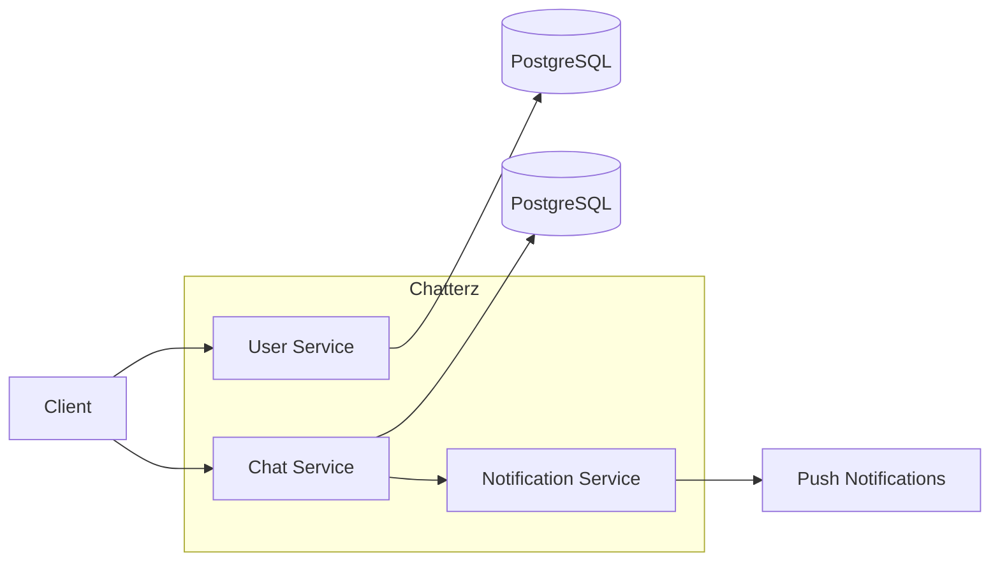

# Chatterz Backend

Backend for a chat application built with Go and designed as a set of independent services.

## Tech Stack

- Go
- Chi
- PostgreSQL
- pgx
- Goose
- Docker
- Kubernetes

## Architecture



# How to Start

## Requirements

Make sure the following are installed:

- Go
- Docker
- kubectl
- Minikube

## 1. Start Minikube

```bash
minikube start
```

## 2. Start PostgreSQL

```bash
kubectl apply -k k8s/
```

Check the PostgreSQL pod:

```bash
kubectl get pods -n chatterz
```

Wait until PostgreSQL running:
```bash
NAME                         READY   STATUS
postgres-xxxxxxxxx-xxxxx     1/1     Running
```

## 3. Forward PostgreSQL port to localhost

```bash
kubectl port-forward -n chatterz service/postgres 5432:5432
```
Keep this terminal running.

## 4. Configure the User Service
From the user-service directory:

```bash
export PORT=8080
export DBHost=localhost
export DBPort=5432
export DBUser=postgres
export DBPassword=postgres
export DBName=user-service
```

## 5. Start the User Service
```bash
go run ./cmd/server/main.go
```